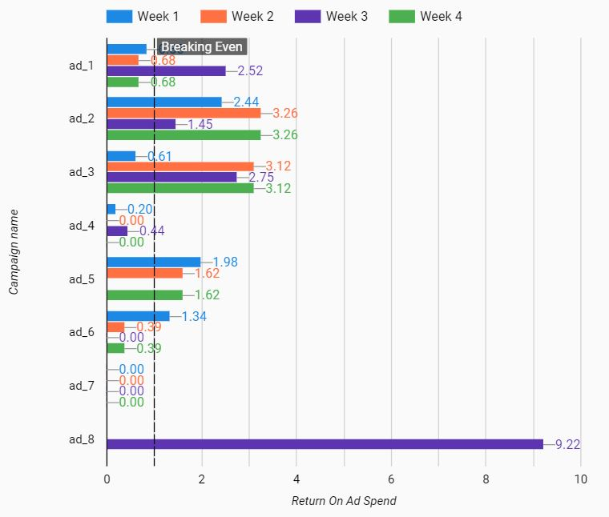

#### Dashboard
Link to dashboard: https://datastudio.google.com/reporting/543bcf3a-0fe0-40ea-889a-b0625ff80c92

# The Inspiration
This project analyzes ad and purchase data.
Initially, this project was done to see how effective ads are on a social media website. Since people on social media platforms focus on interacting with each other, it's hard to see how ads can normally perform well. 
Some arguments that lead me to believe that they would not perform well are:
<ul>
  <li>It's a platform where users are usually not focused on making purchases</li>
  <li>Content creators would need to pay for more publicity on their posts, making publicity weighted more closely to the cost paid for the publicity/ad versus quality of the content/ad</li>
  
  <!--<li> </li>-->
  
</ul>

However, one can argue that maybe the main strategy for companies that want to promote their products on a social media website is to reach as wide of an audience as possible. Maybe products can be tailored to certain audiences who share an interest and will therefore perform better than we would expect.

If this is the case, then how can we measure how successful an ad is? Through the number of people the ad reaches out to? Through the number of people who end up actually making purchases?

These questions are explored through this project.
<!-- talk about users/creators/advertisors and their interests -->

# Measuring Performance
Since the purpose of ads is the make sales, we can use the number of sales that the ad resulted in to gauge how well the ad did. However, this metric would make us prefer many small sales to few big sales, even if the few big sales resulted in more revenue. One way to solve this is to measure performance by using the revenue that the ad made due to its sales. This gives us more information in the form of dollars and also allows us to start thinking of ways to use the cost of the ad to measure how it's doing. Since we want to have higher revenue and lower costs for an ad, we can use a metric that divides the revenue of the ad by the cost of the ad. This incentivizes higher revenue and penalizes higher cost. This metric is called Return On Ad Spend (ROAS). The higher the ROAS is for an ad, the better. If the ad makes as much as it cost, its ROAS would be equal to 1.

Below, we can see the ROAS for each of the implemented ads over 4 weeks:

  

- We see that the ads that perform well are ad_2, ad_3, and ad_8. ad_2 consistently performs well, ad_3 has a bad start but starts to do very well in the later weeks, while ad_8 does very well in the one week it was up.
- The ads that perform noticeably poorly are ad_4, ad_6, and ad_7. While all three of these consistently did not lead to purchases, ad_7 specifically made no sales at all over the four weeks that it was up.

If we were to have removed all badly performing ads, the revenue over the 4 weeks would have increased by 77%.

# Website Traffic/Publicity
While ROAS seems like a good measure of performance of an ad, revenue isn't the only thing a company may want. If a company is new, it may prefer to have publicity and visitors to its website. One way to measure this is an ad's click-through rate (CTR). This is the number of clicks on links within the ad divided by the number of times the ad was shown on screen. If we were to plot each ad's CTR, we obtain the following:

  

What's surprising here is that the ads that had the lowest ROAS (ad_4, ad_6, ad_7) actually have higher CTR by a good amount.
However, once we learn that ad_7 is a giveaway, ad_4 is a Black Friday Cyber Monday sale, and that ad_6 is also a sale, it makes sense. People prefer buying things if they're on sale, or if they're free.

# Takeaways
Compared to the number of people that the ad shows up for, the number of website leads that social media ads produces isn't great at all. However, since the ads reach such a large enough audience, they do end up making enough sales to make them "worth it".

<!-- talk about how creators have to create the ads themselves vs. on youtube, advertisors are separate? -->
